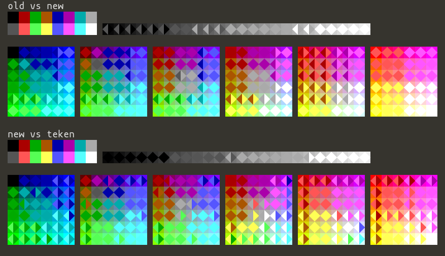

Here's a comparison of how different algorithms coerce colors into the 16-color VGA palette.

old
===

*old* is what I added to vt in 2014; alas this was based on a 256-color
palette formula taken from osso-xterm, then tuned on xfce4-terminal.  Turns
out they differ greatly:
```
 Old: 00 2a 55 7f aa d4 (osso-xterm)
 New: 00 5f 87 af d7 ff (all(?) other terminals)
```
This discrepancy was harmless for \e\[38;5;…m but shifts \e\[38;2;…m in an inconsistent way.

new
===

Adjusted version which I'm about to put into vt.

teken
=====

FreeBSD's take (sys/teken/teken.c)


